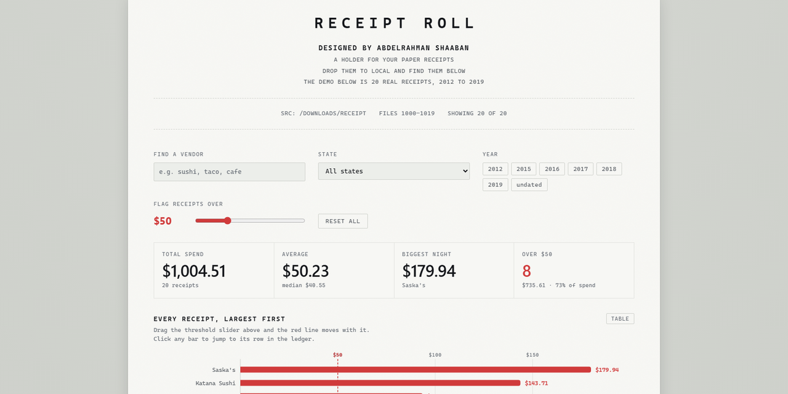

# Receipt Roll

**[View it live](https://receipt-roll.vercel.app)**

Receipt photos in, a ledger out. Every figure on each receipt (shop, date, items, total) was read from the photograph by a vision model; the page turns the results into a filterable ledger with charts and a threshold flag for receipts over a chosen amount.

One self-contained HTML file. No build step, no backend. Built with Claude Code, hosted on Vercel.

The sample data is a small set of receipt photos downloaded from the internet, 2012 to 2019; two receipts carry no printed date and sit outside the timeline. Swap in your own receipts by replacing the data block at the top of the file.
